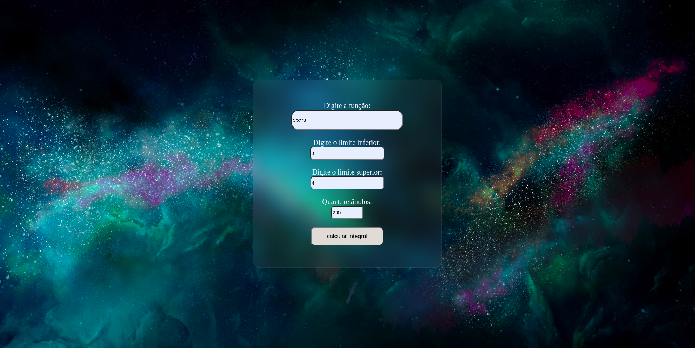
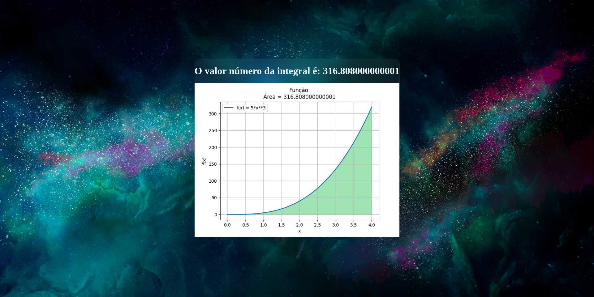
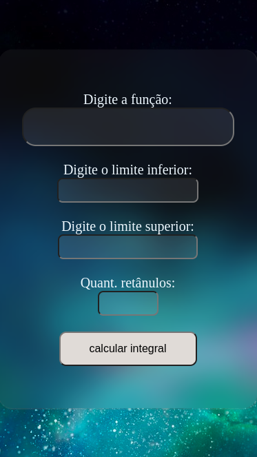

# 🔢 Integral-Solver

# 📑 Sobre o projeto 

**Integral-Solver** é uma aplicação baseada em **Flask** com **HTML** e **CSS**, projetada para funcionar como uma calculadora, permitindo que os usuários calculem integrais facilmente. Além de calcular numericamente a integral, o programa também gera um gráfico com sombreamento da área que está sendo integrada. Isso proporciona uma representação visual da função integrada, permitindo uma compreensão mais intuitiva do conceito matemático envolvido. A área sombreada sob a curva no gráfico corresponde à integral da função, proporcionando uma visão abrangente do processo de integração.

## 📸 Visuals and Screenshots

Dê uma espiada nas imagens abaixo para ter uma prévia visual do projeto em ação. As capturas de tela oferecem um vislumbre das principais características e do design envolvente.

### 💻 Layout web
 

 

### 📱 Layout mobile


## 📚 Stack Tecnológica

[](https://www.python.org/)
[](https://flask.palletsprojects.com/)
[](https://www.sympy.org/)
[](https://numpy.org/)
[](https://developer.mozilla.org/en-US/docs/Web/Guide/HTML/HTML5)
[](https://developer.mozilla.org/en-US/docs/Web/CSS)

# 🚀 Como executar o projeto 🚀

## ⚙ Pré-requisitos

Você precisa ter o Python 3 instalado em seu computador. O Python 3 está disponível em [python.org](https://www.python.org/), e você pode baixá-lo clicando no link abaixo:

[](https://www.python.org/)

Após instalar o Python 3, entre no diretório do projeto com o seguinte comando no seu terminal:

```
cd /Integral-Solver
```

## ✨ Tudo pronto! ✨

Agora basta executar o projeto com o comando:

```
python3 app.py
```

Aguarde a conclusão da compilação e vá para http://127.0.0.1:5001 após o término da compilação. Para sair, pressione Ctrl + C.

## 🚨 Aguarde! Ainda não terminou!

>O Integral-Solver é um projeto de código aberto, oferecendo uma solução para cálculos integrais de forma gratuita. Os usuários têm total liberdade para utilizar, modificar e contribuir para o projeto. Essa abordagem colaborativa visa criar uma comunidade engajada, onde as contribuições de todos são valorizadas. Sinta-se à vontade para explorar, adaptar conforme suas necessidades e, se desejar, contribuir com melhorias. Acreditamos na força da comunidade para aprimorar e evoluir projetos como o Integral-Solver, tornando-o uma ferramenta cada vez mais útil e versátil para todos.

## 📜 Licença

[](https://github.com/DenissonPereira/Integral-Solver/blob/main/LICENSE) 

## ✏️ Autor 

Denisson Pereira Santos

<div> 
<a href="https://www.linkedin.com/in/denisson-pereira" target="_blank"></a> 
<a href="https://denissonpereira.com" target="_blank"></a> 
<a href="https://github.com/DenissonPereira" target="_blank"></a> 
<a href="https://www.instagram.com/denisson_pereira1?igshid=OGQ5ZDc2ODk2ZA%3D%3D&utm_source=qr" target="_blank"></a>
</div>&nbsp;&nbsp;